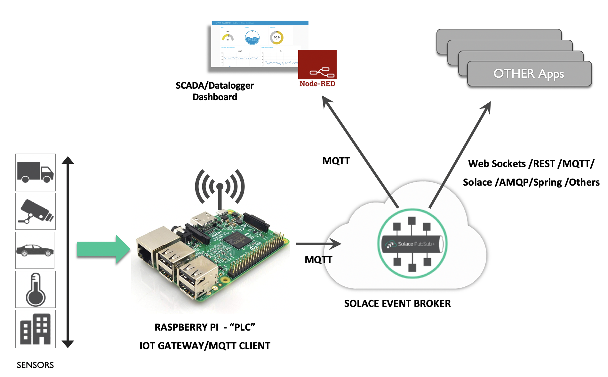
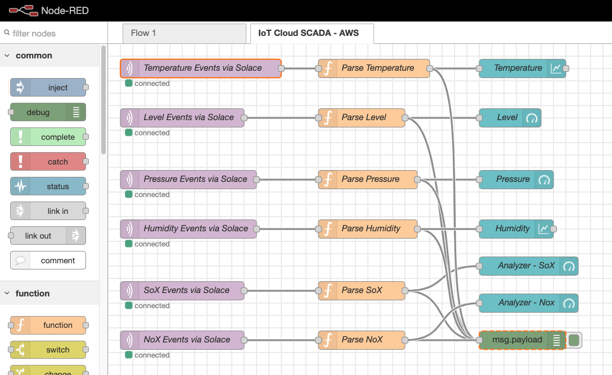
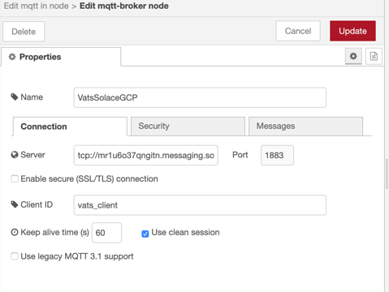
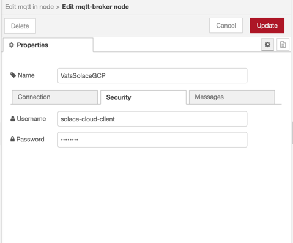
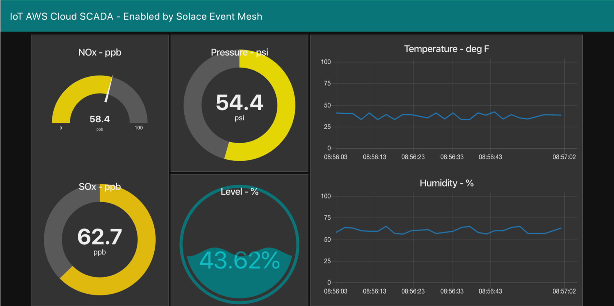
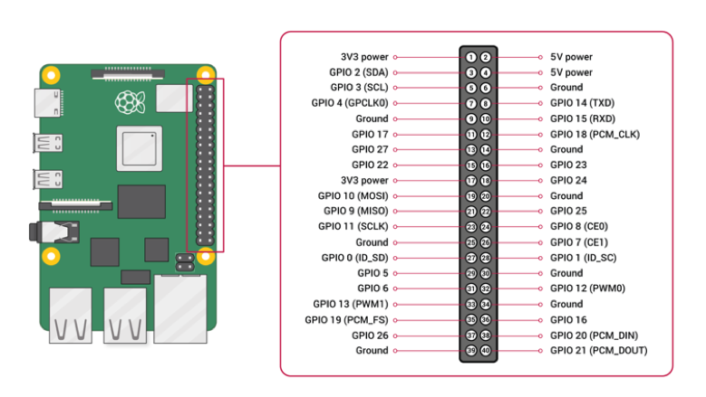
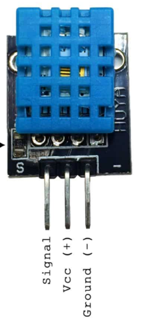
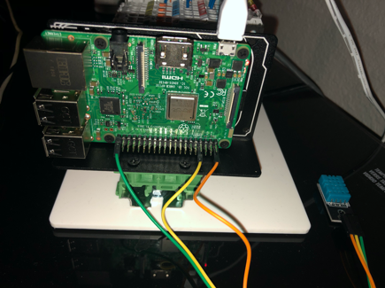
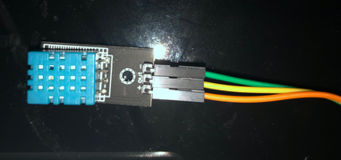

# RaspberryPi-Solace-SCADA

This repository holds code samples for using Solace Event Broker to distribute real-time sensor readings from Raspberry Pi to consuming applications on the edge/cloud. 

The following items are available, skip to the proper section in the README below for each: 
- [Deploy the IoT SCADA Demo](#deploy-the-iot-scada-demo)
- [Simple Python MQTT Examples](#simple-python-mqtt-examples)

## Deploy the IoT SCADA Demo
This is the demo that was presented during the MakeUofT Hackathon 2020 @ University of Toronto, CA.

### Demo Architecture
The demo that we will be creating is a Solace IoT SCADA Demo. It shows how a raspberry PI can stream data from connected sensors into Solace PubSub+ Event Brokers. Once the event streams are available the demo uses Node-RED flows to consume the events and display the sensor data on a real-time, dynamic dashboard. 

### Solace PubSub+ Features Used
- Multi-Protocol Pub/Sub
- Multi-API
- Topic filtering/routing
- Eliding (future)
- MQTT Retain (Future)

### Prerequisistes
Hardware needed: 
- Raspberry PI 3 (or equivalent) w/ login credentials & internet access
- (Optional) DHT11 Digital Temperature and Humidity Sensor

### Sign-up for Solace Cloud & Get your credentials
- Sign up here: http://bit.ly/Solace-Cloud
- Launch a free messaging service. More info [here](https://solace.com/cloud-learning/group_getting_started/ggs_signup.html)
- Once you launch your free messaging service go to the **Connect** tab, choose **MQTT** and capture your connect info for later. 

### Setup the Node-RED Dashboard
#### Install Node-RED & the Dashboard
1.	Install Node-Red - https://nodered.org/docs/getting-started/local
1.	Run `node-red` on terminal/command prompt
1.	Go to http://localhost:1880 to verify installation
1.	Install Dashboard Nodes - https://flows.nodered.org/node/node-red-dashboard
1.	Clone this repo & from the folder - [makeuoft-hackathon-master/raspberrypi2solace/subscribe](https://github.com/SolaceLabs/makeuoft-hackathon/tree/master/raspberrypi2solace/subscribe) copy SCADA_subscribe.json to any folder on local machine
1.	Import the json into Node-Red editor from Menu-Import

#### Configure the Dashboard
1.      Choose the "IoT Cloud SCADA - AWS" Flow that now appears on the screen. 

1.	Open node “Temperature Events via Solace” Click edit

 
1.	Edit the *Server* field and replace it with the **MQTT Host URL including tcp:// and the port number**
1.	Provide any name for the Client ID. This is just a name that identifies the client application to the event broker. 
1.	Navigate to the security tab and enter your client *Username* and *Password*. These values can be found in Solace Cloud on the connect tab that we navigated to earlier.  

1.	Make sure all 5 other “Event” nodes (Level Events via Solace, Pressure Events via Solace, etc) have the connectivity information you just provided as well. 
1.	Click “Deploy” button on right corner of the screen.

#### View the SCADA Dashboard!
1.	Go to http://localhost:1880/ui
1.	The SCADA dashboard should be displayed with static values.

### Connect the hardware 
This section is only necessary if you are using the physical DHT11 sensors to supply Temperature & Humidity. 

**Before starting this section shutdown and unplug your raspberry pi**

Lookup the Pin configuration for your Raspberry Pi, such as the below:

Using the cables provided with the physical sensors connect your DHT11 to your Raspberry PI. The DHT11 sensor should have 3 pins as seen in the photo below.

Connect them as follows: 
- Signal/Data to a GPIO Pin on the Raspberry PI (such as GPIO 17 / physical pin 11 in the pin configuration image above) 
- VCC (+) to a 3V or 5V Pin on the Raspberry PI (such as physical pin 1 in the pin configuration image above) 
- Ground (-) to a Ground Pin on the Raspberry PI (such as physical pin 6 in the pin configuration image above)

**You can now power-up your raspberry pi**

### Stream the Sensor Data to Node-RED via Solace Event Brokers

#### Prepare to stream events using Python & MQTT
- ssh into Raspberry Pi 
- Install python 3.7 `sudo apt install python3-pip`
- Install paho-mqtt to send events over mqtt `pip3 install paho-mqtt`

#### Stream Events from the physical DHT11 sensor
Install Adafruit_DHT to read the physical sensor `pip3 install Adafruit_DHT`
- Test the physical sensor by following these steps
  - Edit `simpletest.py` and update the `pin` variable value to match the GPIO number you connected the Signal/Data pin of your DHT11 sensor to. If you followed the pin configuration above that would be `17`
  - Run the script: `python3 simpletest.py`
  - You should see Humidity and Temperature reading on the screen; go ahead and kill the script using `ctrl-c`

- Now that we know the sensor works let's stream the data to the PubSub+ Event Broker using MQTT. 
  - Open the *raspi_solace_publish_json.py* file to edit it.
    - Update the pin # again on line 13. 
    - Update the `solace_url`, `solace_port`, `solace_user` and `solace_passwd` to match your connection info from Solace Cloud. Remember we got this info under **MQTT** on the connect tab. 
  - Run the script to start streaming events: `python3 raspi_solace_publish_json.py`
  - You should see Humidity and Temperature streaming readings on the screen and on Node-Red SCADA dashboard we setup earlier!
	
#### Stream Events from the virtual sensors 
Let's also stream sensor data from some virtual sensors.
- Open the *virtual_solace_publish_json.py* file and edit `solace_url`, `solace_port`, `solace_user` to & `solace_passwd` to match your connection info from Solace Cloud. Remember we got this info under **MQTT** on the connect tab. 
- Run the script to start streaming events: `python3 virtual_solace_publish_json.py`
- You should see Level, Pressure, NoX and SoX streaming readings on the screen and on Node-Red SCADA dashboard we setup earlier!
  
Awesome job! You have now setup the SCADA demo. Your raspberry PI is now reading data from both physical and virtual sensors and streaming them as events in real-time across the Solace PubSub+ Event Broker. Once on the PubSub+ Event Broker any application, with proper permissions, can subscribe to consume those events. In this demo we created a Node-RED dashboard to do just that, but because we are following the *publish-subscribe* pattern a stream of events can be consumed by multiple consumers so go ahead and add your own consumers as well! 

## Simple Python MQTT Examples
Check out this python script which shows how to publish events to Solace PubSub+ using MQTT.
- [Simple Publisher](publish/virtual_solace_publish_json.py)

Check out this python script which shows how to subscribe to an event stream from Solace PubSub+ using MQTT. 
- [Simple Subscriber](subscribe/simplesubscriber.py)
